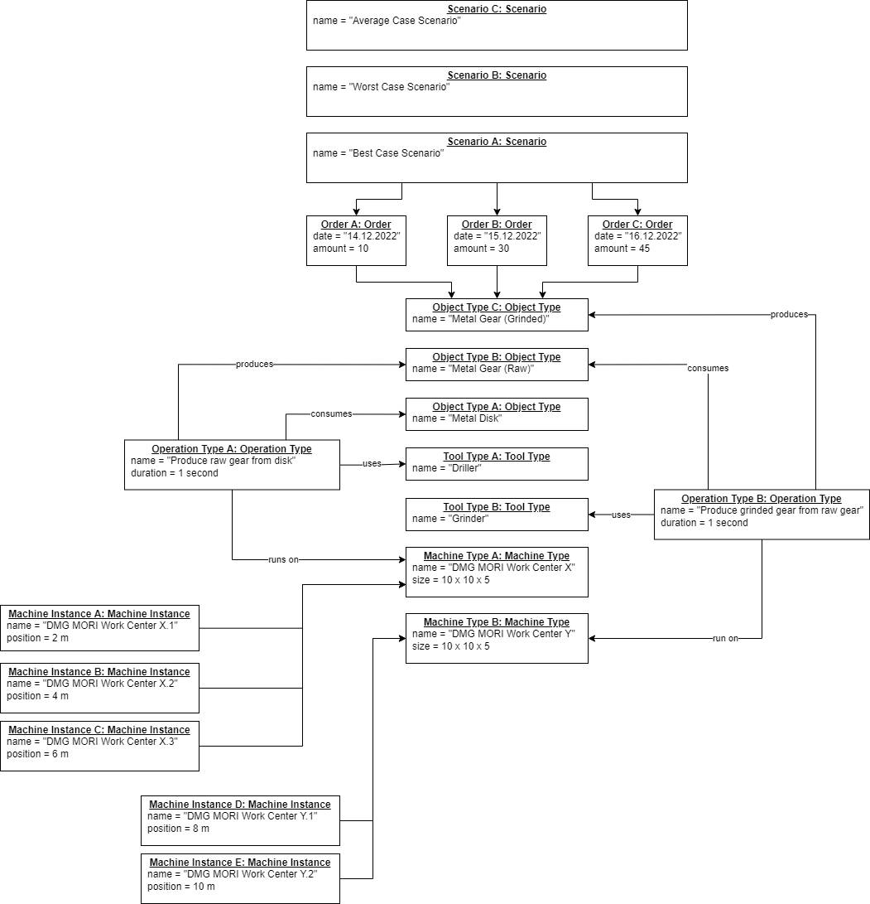

# Factory Design Automation

In this project we study techniques for reducing the effort of modeling and analyzing factory layouts.
To achieve this goal, we develop an easy-to-use configurator and simulator for a particular class of factories.
More precisely, we concentrate on flexible manufacturing systems, which can be adapted to a variety of products and processes.
We assume that the material flow between the work stations of the factory is handled completely by gantry robots.

## Screenshots

Here are some screenshots of our prototypes:

### 🖼️ Simulator

We provide a discrete event simulator with 3D visualization capabilities.

### 🖼️ Visualizer

We also provide a visualization of the possible products and processes.

### 🖼️ Editor

Finally, we provide a basic editor for changing your factory layout.

## Models

Here are some models explaining our overall idea:

### 📈 Class model

The class model describes the entities of factory design:

### 📈 Object model

The object model describes an example factory design:

## Folders

You find more information in the following folders:

* [Concepts](./concepts)
* [Models](./models)
* [Prototypes](./prototypes)
* [Screenshots](./screenshots)